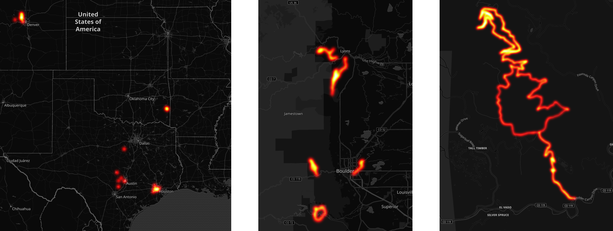
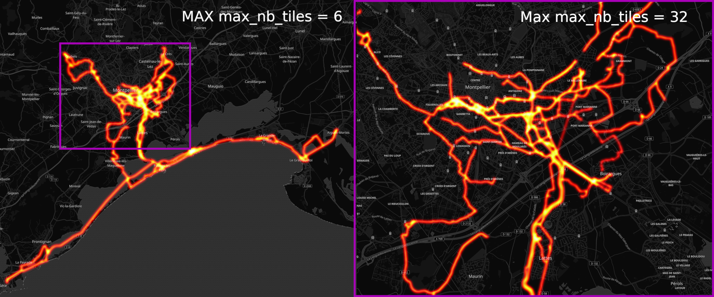

# strava_local_heatmap.py

Python script to reproduce the Strava Global Heatmap (https://www.strava.com/heatmap) with local GPX data

## Usage:

* Download the GPX files from Strava (cf. https://support.strava.com/hc/en-us/articles/216918437-Exporting-your-Data-and-Bulk-Export)
* Copy the GPX files to the `gpx` folder
* [Optional] For best resolution, update `max_nb_tiles` var in `strava_local_heatmap`
* Run `python3 strava_local_heatmap.py`
* The heatmap PNG file `heatmap.png` is saved to the current directory

**Zoom Comparison**

## Python dependencies:

* Python 3 (tested with Python 3.7.0)
* NumPy
* Matplotlib
* scikit-image (https://scikit-image.org/)

## Distribution dependencies

### Archlinux

`sudo pacman -S tk`

### Debian/Ubuntu

`sudo apt-get install tk`