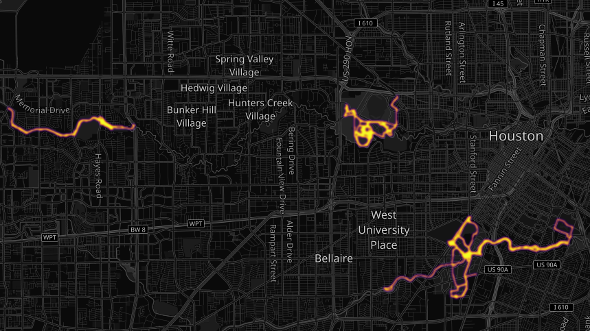

# strava_heatmap

## Usage:

* Download the GPX files from Strava to the /gpx folder (cf. https://support.strava.com/hc/en-us/articles/216918437-Exporting-your-Data-and-Bulk-Export)
* Change the `latitude, longitude bounding box` in strava_heatmap.py to fit the GPX data
* Run `strava_heatmap.py`, the heatmap PNG files (heatmap.png, heatmap_data.png) are saved in the current directory

## ToDo:

* Calculate trackpoints speed + modulation with elevation gradient

