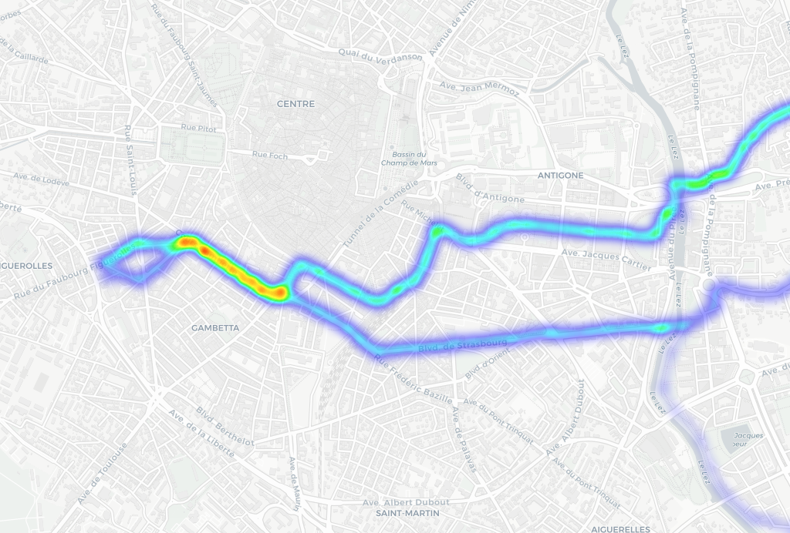

# strava_local_heatmap.py

Python script to reproduce the Strava Global Heatmap (https://www.strava.com/heatmap) with local GPX data

## Usage:

* Download your GPX files from Strava to the `gpx` folder (cf. https://support.strava.com/hc/en-us/articles/216918437-Exporting-your-Data-and-Bulk-Export)
* [Optional] To change the resolution, update `max_nb_tiles` in `strava_local_heatmap.py`
* Run `python3 strava_local_heatmap.py`
* The heatmap PNG and CSV files are saved to the current directory

**heatmap.png:**


**heatmap.csv visualization with** [umap.openstreetmap.fr](https://umap.openstreetmap.fr)**:** (contribution by [@badele](https://github.com/badele))

[link to dynamic map](https://umap.openstreetmap.fr/en/map/demo-heatmap_261644)

## Python dependencies:

**Running in virtualenv**

```
VIRTUALENV=.virtualenv

python3 -m venv $VIRTUALENV
source $VIRTUALENV/bin/activate
pip install --upgrade pip
pip install -r ./requirements.txt
```

* Python >= 3.7.0
* Requests >= 2.20.1
* NumPy >= 1.15.4
* Matplotlib >= 3.0.1
* scikit-image >= 0.14.0 (https://scikit-image.org/)

## Distribution dependencies:

### Archlinux

`sudo pacman -S tk` (cf. https://github.com/remisalmon/strava-local-heatmap/pull/3)
