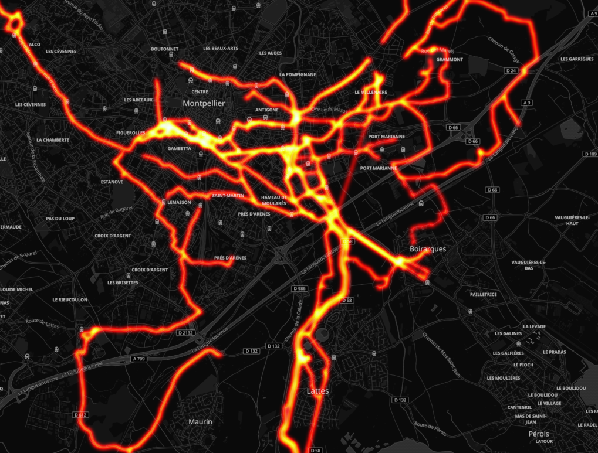

# strava_local_heatmap.py

Python script to reproduce the Strava Global Heatmap ([www.strava.com/heatmap](https://www.strava.com/heatmap)) with local GPX data

Optimized for cycling :bicyclist: activities

## Usage

* Download your GPX files from Strava and copy them to the `gpx` folder  
(see https://support.strava.com/hc/en-us/articles/216918437-Exporting-your-Data-and-Bulk-Export)
* Run `python3 strava_local_heatmap.py`
* The **heatmap.png** image is saved to the current directory

### Command-line options

```
usage: strava_local_heatmap.py [-h] [--gpx-dir DIR] [--gpx-filter FILTER]
                               [--gpx-year YEAR]
                               [--gpx-bound BOUND BOUND BOUND BOUND]
                               [--output FILENAME] [--max-tiles MAXTILES]
                               [--sigma-pixels SIGMA] [--csv-output]
                               [--no-cdist]

optional arguments:
  -h, --help            show this help message and exit
  --gpx-dir DIR         directory containing the GPX files (default: gpx)
  --gpx-filter FILTER   regex filter for the GPX files (default: *.gpx)
  --gpx-year YEAR       year for which to read the GPX files (default: all)
  --gpx-bound BOUND BOUND BOUND BOUND
                        heatmap bounding box as lat_north_bound,
                        lon_west_bound, lat_south_bound, lon_east_bound
                        (default: 90 -180 -90 180)
  --output FILENAME     heatmap file name (default: heatmap.png)
  --max-tiles MAXTILES  heatmap maximum dimension in tiles, 1 tile = 256
                        pixels (default: 3)
  --sigma-pixels SIGMA  heatmap Gaussian kernel half-bandwith in pixels
                        (default: 2)
  --csv-output          enable CSV output of the heatmap in addition to the
                        PNG image (lat,lon,intensity)
  --no-cdist            disable cumulative distribution of trackpoints
                        (converts to uniform distribution)
```

Example:  
`strava_local_heatmap.py --gpx-year 2018 --gpx-filter *Ride*.gpx --gpx-bound 51.26 -5.45 41.26 9.86`

## Output

**heatmap.png**  


**heatmap.csv visualization**  
https://umap.openstreetmap.fr/en/map/demo-heatmap_261644 (contribution by [@badele](https://github.com/badele))

## Installation

To setup in a local Python virtual environment, run `bash setup.sh`  
(`source activate .virtualenv/bin/activate` to enter the virtual environment, `deactivate` to exit)

### Python dependencies

```
python >= 3.7.1
requests >= 2.20.1
matplotlib >= 3.0.2
numpy >= 1.15.4
scipy >= 1.1.0
```

### Other dependencies

#### Arch Linux

`sudo pacman -S tk` (see [here](https://github.com/remisalmon/strava-local-heatmap/pull/3#issuecomment-443541311))

## Projects using strava_local_heatmap.py

- [JeSuisUnDesDeux](https://gitlab.com/JeSuisUnDesDeux/jesuisundesdeux/tree/master/datas/traces)
